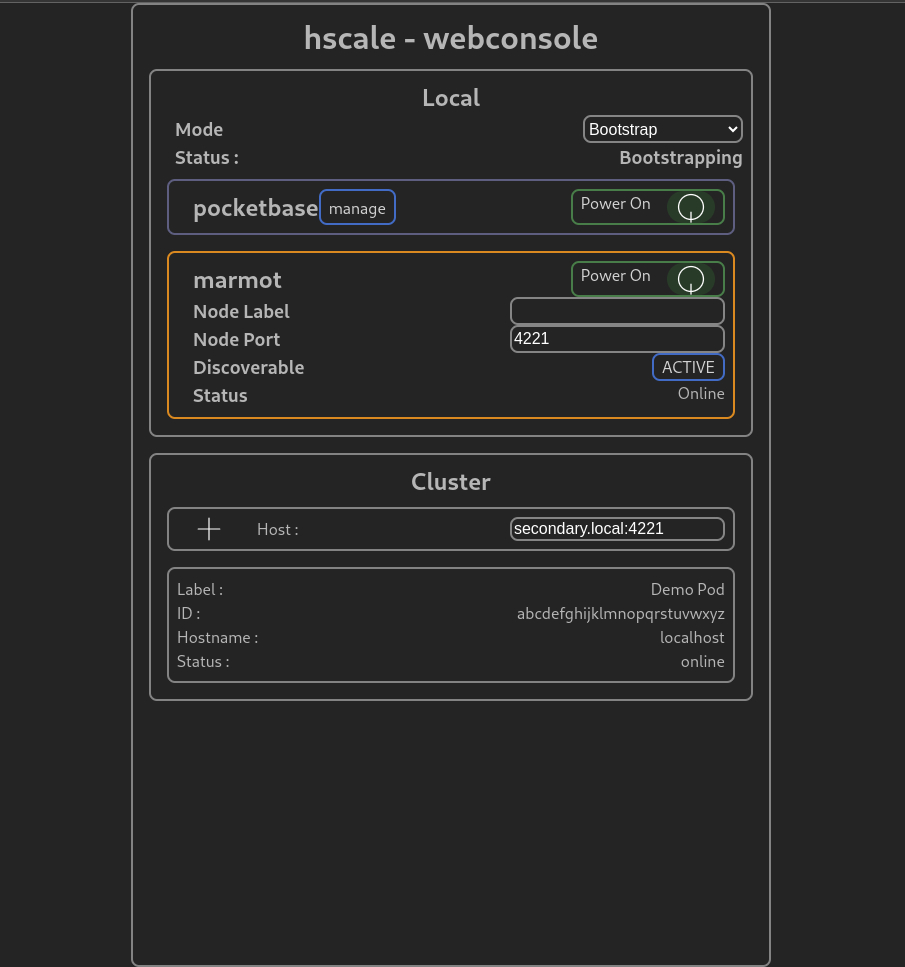

# hscale
horizontal scale

A pocketbase + marmot management console

## state - NOT READY
- webconsole
  - can power on/off pocketbase
- API
  - /api/status/(all|pb|marmot)
  - /api/toggle/(pb|marmot)
- containers
  - base - ubuntu latest + apt-get update
  - hscale - uses base
    - pocketbase on port 8090
    - marmot on port 8091
    - deno webconsole http server/api on port 8092
## TODO
- start/stop marmot
- discovery/linking of cluster

## legend

[pocketbase](https://pocketbase.io) ([github](https://github.com/pocketbase/pocketbase)) - an awesome real-time database

[marmot](https://maxpert.github.io/marmot/) ([github](https://github.com/maxpert/marmot)) - a decentralized sqlite database replicator

[sqlite](https://sqlite.org) - an awesome database engine, used by pocketbase

replication - a way to synchronize database copies for backup and/or load distribution purposes

## purpose
Using marmot can be tedious. You have to tell each node about the others.

This container hosts pocketbase, marmot, and hscale deno http webconsole/api.

marmot and pocketbase do the jobs they already do.

hscale webconsole, api, and discovery automates the process of linking marmot nodes.

Adding a node to the local hscale node will trigger the other nodes to add it back.

## Usage

### install
- clone the repo to a node that will join your cluster

`git clone https://github.com/RepComm/hscale`

- navigate to cloned repo

`cd ./hscale`

- build base image

`cd ./base`

`./build.sh`

- build hscale image

`cd ../hscale`

`./build.sh`

### run
- start podman container

`./start.sh`
> [hscale][log] Web Console: http://localhost:10209/ui

Start will auto-create the persistence volume based on the container name

You can run custom args for ./start.sh:
`./start.sh [CONTAINER_NAME | "hscale"] [POCKET_PORT | 8090] [MARMOT_PORT | 8091] [HSCALE_PORT | 8092] [DETACH | -d]`

ex: `./start primary`
> [hscale][log] Web Console: http://localhost:10209/ui

ex: `./start secondary 8093 8094 8095 -d`
> [INFO] Will run in detached mode - webconsole will be available at http://localhost:8082/ui

The container name is prefixed with `hscale-`

If only calling `./start.sh` then the container will be hscale-hscale using the hscale-hscale image

These arguments are useful when you want to run multiple hscale instances on one machine

### configure
open the URL provided in a browser

#### first-node
if this is your first node:
- set Mode to "Seed"
- Click Pocketbase "Power On" button
- click "Manage" to open pocketbase web UI
  - create your collections as usual for pocketbase
- Click Marmot "Power On" button

#### additional-nodes
if this is an additional node:
- set Mode to "Bootstrap"
- Click Pocketbase "Power On" button
- Click Marmot "Power On" button
- Add the host:port of a node that has "Seed" mode set in Cluster section
  - Node will begin copying from online Seed nodes
  - Local node and Seed node will auto set to "Replicate" mode when complete
  - No further action on any node is normally required
