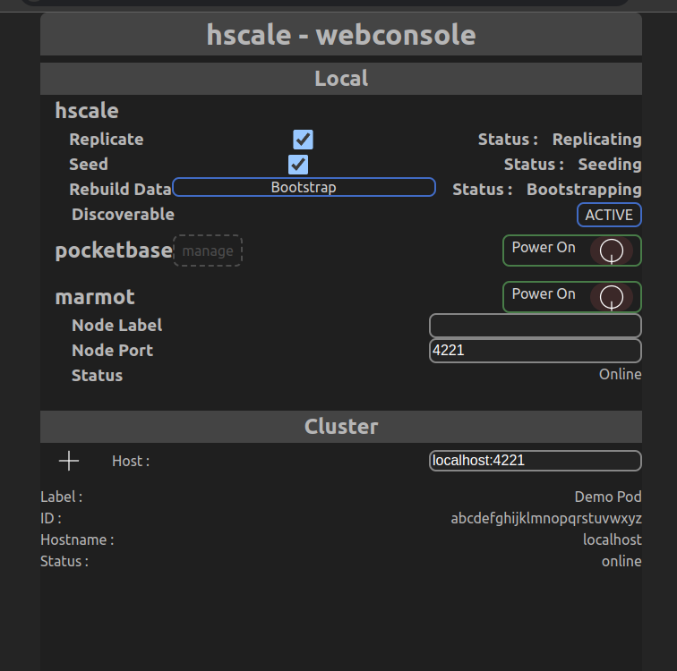

# hscale
horizontal scale

A pocketbase + marmot management console

## state - NOT READY
- web UI - partially implemented
- containers - partially implemented

## TODO
- deno hscale app is not written yet
  - when finished it will be responsible for starting and stopping marmot and pocketbase inside of a podman container, as well as host the hscale web UI, and discovery/linking of cluster

## legend

[pocketbase](https://pocketbase.io) ([github](https://github.com/pocketbase/pocketbase)) - an awesome real-time database

[marmot](https://maxpert.github.io/marmot/) ([github](https://github.com/maxpert/marmot)) - a decentralized sqlite database replicator

[sqlite](https://sqlite.org) - an awesome database engine, used by pocketbase

replication - a way to synchronize database copies for backup and/or load distribution purposes

## purpose
I wanted to get into scaling pocketbase horizontally for production use, and found marmot to suit my needs.

However the concept of having to manipulate each node in a cluster to add just one additional node seemed like extra work.

This project aims to make the process as easy as a few button clicks, and typing a host:port once per node in the cluster.

Adding a node to the local hscale node will trigger the other nodes to add it back.

